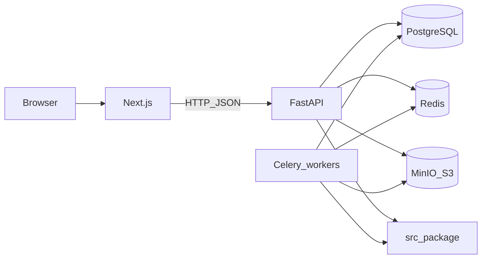

# AGENTS.md — ProphitBet

Instructions for humans and AI agents working in this repository.

## Products in this repo

| Area | Path | Role |
|------|------|------|
| **Desktop app** | [`app.py`](app.py), [`src/`](src/) | PyQt GUI, ML training, league downloaders, preprocessing, desktop FootyStats (Selenium) |
| **SaaS** | [`prophitbet-saas/`](prophitbet-saas/) | FastAPI API, Next.js frontend, Docker Compose, Celery workers |

The SaaS **reuses** the desktop ML stack by importing [`src/`](src/) (see `ML_CORE_PATH` / `PYTHONPATH` in Docker and [`backend/app/config.py`](prophitbet-saas/backend/app/config.py)). **Do not duplicate** model training or statistics logic under `prophitbet-saas/backend` except thin services/adapters.

## High-level architecture (SaaS)



## Golden commands (SaaS)

From repo root, with Docker:

```bash
cd prophitbet-saas
docker compose up -d --build
```

Typical ports (see [`docker-compose.yml`](prophitbet-saas/docker-compose.yml)): API **8001** → container 8000, frontend **3001** → 3000, Postgres **5433** → 5432, Redis **6380** → 6379.

Seed admin + leagues (inside backend container):

```bash
docker compose exec backend python -m backend.seed
```

**Admin prediction pipeline (order matters):** after league CSV sync has finished — **Train House Models** → **Scrape Fixtures** → **Generate Predictions**. Use the Admin UI or the matching `/admin/*` POST routes.

Desktop app:

```bash
python app.py
```

(Or `app.bat` on Windows.)

## Read-first map (where to look)

| Topic | Start here |
|-------|------------|
| League CSV sync / stats | [`prophitbet-saas/backend/app/workers/data_sync.py`](prophitbet-saas/backend/app/workers/data_sync.py), [`src/preprocessing/statistics.py`](src/preprocessing/statistics.py) |
| Fixtures (SaaS HTTP scraper) | [`prophitbet-saas/backend/app/workers/fixtures.py`](prophitbet-saas/backend/app/workers/fixtures.py) |
| Fixtures (desktop Selenium) | [`src/network/fixtures/footystats/scraper.py`](src/network/fixtures/footystats/scraper.py) |
| Predictions worker | [`prophitbet-saas/backend/app/workers/predict.py`](prophitbet-saas/backend/app/workers/predict.py) |
| API routes | [`prophitbet-saas/backend/app/api/`](prophitbet-saas/backend/app/api/) |
| Frontend API client | [`prophitbet-saas/frontend/lib/api.ts`](prophitbet-saas/frontend/lib/api.ts) |
| League catalog | [`storage/network/leagues.json`](storage/network/leagues.json) |

Deeper diagrams: [`docs/architecture-cursor.md`](docs/architecture-cursor.md).

## Cursor-specific

- **Project rules** live in [`.cursor/rules/*.mdc`](.cursor/rules/) (scoped by glob or `alwaysApply`).
- **Indexing**: [`.cursorignore`](.cursorignore) excludes large/generated artifacts from `@codebase` search.
- **Memories / User Rules** are per-user in Cursor Settings; they are **not** committed. Use this file + rules for team-wide behavior.

### IDE: 21st.dev Magic MCP (optional UI generation)

[21st.dev Magic MCP](https://github.com/21st-dev/magic-mcp) integrates the IDE with 21st.dev for AI-assisted UI generation (e.g. `/ui …`). It is **not** a runtime dependency of the Next.js app—only IDE configuration and optional generated files under `prophitbet-saas/frontend/`.

Setup, API key safety, and ProphitBet frontend conventions: [`docs/cursor-21st-magic.md`](docs/cursor-21st-magic.md).

## Agent workflow

1. Read this file and the relevant `.mdc` rule for the files you edit.
2. Confirm scope: desktop (`src/`) vs SaaS (`prophitbet-saas/`) vs shared ML (`src/` + SaaS services).
3. Keep changes minimal and on-task; avoid unrelated refactors.
4. Verify with Docker or `python` smoke tests as appropriate for your change.

Do **not** edit attached plan files under `.cursor/plans/` when implementing features unless the user explicitly asks.
