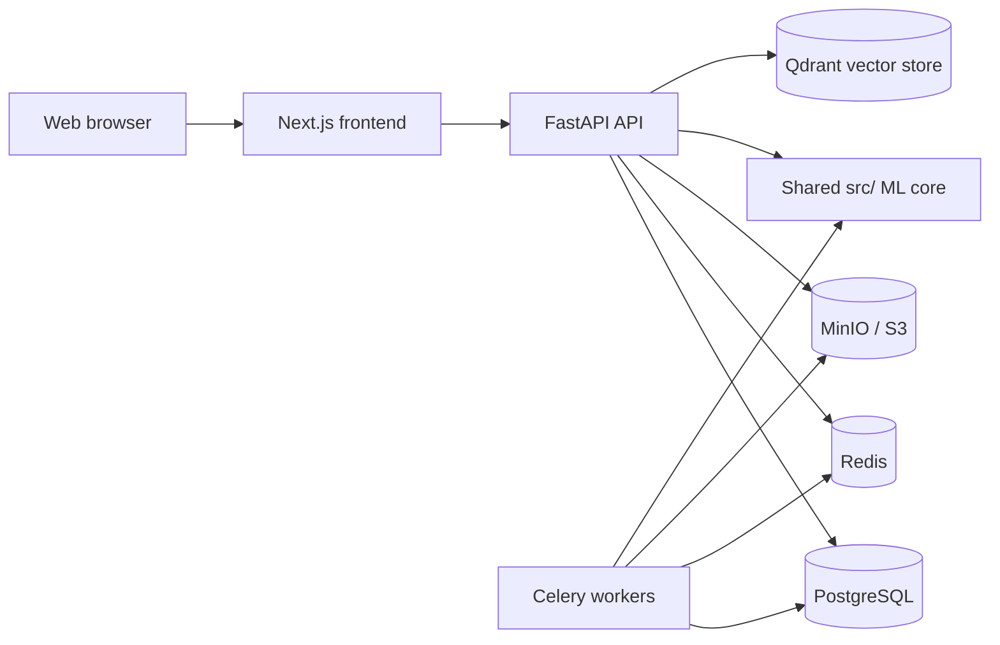

# 43v3rB3tz

43v3rB3tz is a football data and prediction system with a desktop research app and a web SaaS platform. Both products use the same Python machine-learning and statistics core in `src/`; the SaaS backend adapts that core for its API and background workers instead of maintaining a second implementation.

The project supports football analysis and experimentation. Predictions and betting-related calculations are estimates, not guarantees or financial advice. The system does not place bets.

## Products

### Desktop research app

The PyQt6 application (`app.py`) is for working directly with historical league data and local models.

- Download and manage league datasets, calculate team and match statistics, and inspect match rows in a searchable, filterable table.
- Analyze features with descriptive statistics, distributions, variance, correlation, Boruta selection, logistic-regression coefficients, tree impurity, and decision-tree rule extraction.
- Train and tune logistic regression, LDA/QDA, decision trees, random forests, XGBoost, K-nearest neighbors, Naive Bayes, support-vector machines, and deep neural networks.
- Evaluate models with holdout data, k-fold and sliding-window cross-validation, and metrics including accuracy and profit balance. Filter evaluation by odds and predicted probabilities.
- Generate offline predictions or parse upcoming fixtures and export selected results. The desktop fixture scraper uses Selenium and requires a compatible Chrome installation.

Run the desktop app from the repository root:

```bash
python -m pip install -r requirements.txt
python app.py
```

On Windows, `app.bat` is also available. Linux users can use `app.sh`.

### Web SaaS

The Next.js frontend and FastAPI backend provide browser-based access to shared league, model, fixture, and prediction workflows. The platform includes:

- User registration and login, profile preferences, optional OAuth providers, subscription and billing integrations, and an admin area.
- League browsing, historical statistics, upcoming fixtures, daily predictions, and prediction history.
- House and user-trained models, asynchronous training and auto-tuning jobs, and model explainability tools.
- Analysis and quantitative backtesting, including closing-line-value and odds-drift views.
- MiroFish simulation and tactical-intelligence features, backed by Qdrant vector search when configured and available.
- A personal bet-slip journal and South African market tools for observed-odds comparison, AI-assisted slip suggestions, theoretical arbitrage checks, expected-value comparisons, and bookmaker margin analysis.

Supported shared model targets include match result, over/under goals, both teams to score, total-goal thresholds, team-goal thresholds, corners, and shots on target. Availability depends on the data recorded for a league and target; missing outcomes are not treated as negative examples.

For match-result predictions, the SaaS combines the trained model with de-margined bookmaker probabilities and a Dixon-Coles estimate when the required data is available. Other supported targets use their matching trained classifiers. This combination is a model estimate, not a claim of certainty.

## Data integrity and market evidence

Data quality is part of the product. League sync validates downloaded datasets before updating stored snapshots. Fixture and result workflows track source and verification evidence, and reconciliation avoids guessing when team identity or scores are ambiguous.

Bookmaker prices are only useful when observed and matched to a fixture. The market importer rejects stale snapshots, unsupported layouts, ambiguous kickoff times, virtual events, invalid prices, and non-unique fixture matches. It does not fabricate replacement prices. As a result, odds, value, arbitrage, or slip features can report no available data when a source is empty or cannot be verified. Any apparent arbitrage or expected value is theoretical and can disappear before a bet is accepted.

The optional host-side browser collector and synchronization scripts are in the repository root (`start-bookmaker-feed.ps1`, `sync-bookmaker-data.ps1`, and `tools/`). Provider access, jurisdiction, and source availability can change independently of this code.

## Architecture



The repository also contains Prometheus metrics and alerts, Grafana dashboards, Loki/Alloy log collection, exporters, a code-checker service, and SonarQube configuration. They are operational tooling, not prerequisites for running the desktop app.

## Run the SaaS stack

Prerequisites: Docker Desktop with Docker Compose. From the repository root:

```powershell
Set-Location prophitbet-saas
Copy-Item .env.example .env
```

Edit `prophitbet-saas/.env` to configure secrets and any optional providers, then start the stack:

```powershell
docker compose up -d --build
```

The local Compose URLs are:

| Service | URL |
|---|---|
| Web app | <http://localhost:3005> |
| FastAPI and OpenAPI docs | <http://localhost:8001/docs> |
| MinIO console | <http://localhost:9001> |
| Grafana | <http://localhost:3002> |
| Prometheus | <http://localhost:9095> |
| Flower (Celery) | <http://localhost:5555> |
| SonarQube | <http://localhost:9100> |

Initialize the local admin account and league catalog from the SaaS directory:

```powershell
docker compose exec backend python -m backend.seed
```

To prepare daily predictions, run the admin pipeline in order after league data is available: **sync league data**, **train house models**, **scrape fixtures**, then **generate predictions**. The API health endpoint is `http://localhost:8001/health`.

The Compose file includes a host-specific Qdrant storage path. Adjust that bind mount in `docker-compose.yml` if `C:/Users/p3rc/qdrant_storage` is not suitable on your machine. Optional integrations such as OAuth, Stripe, external football data, MiroFish/LLM services, and bookmaker feeds require their own valid credentials or reachable providers. The example environment is for local development only; use unique secrets and secure service credentials for any non-local deployment.

## Repository map

| Path | Purpose |
|---|---|
| `app.py`, `src/gui/` | PyQt6 desktop application |
| `src/` | Shared data processing, statistics, models, evaluation, and prediction logic |
| `prophitbet-saas/backend/` | FastAPI API, database models, services, and Celery workers |
| `prophitbet-saas/frontend/` | Next.js SaaS interface |
| `prophitbet-saas/docker-compose.yml` | Local SaaS and observability stack |
| `storage/` | League catalogs and local operational data |
| `docs/` | Architecture, integrity, and implementation notes |

## License and attribution

43v3rB3tz is derived from the ProphitBet Soccer Bets Predictor project. See [LICENSE.txt](LICENSE.txt) and the retained attribution notices for licensing and upstream details.
