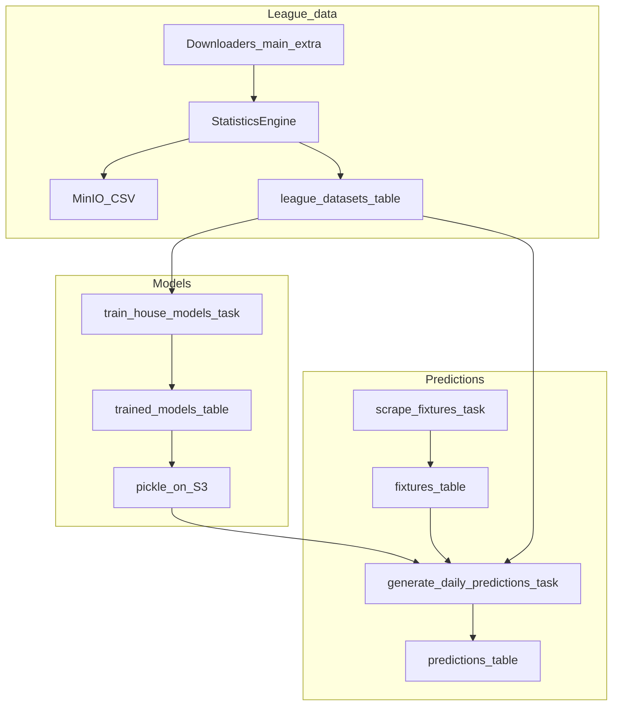
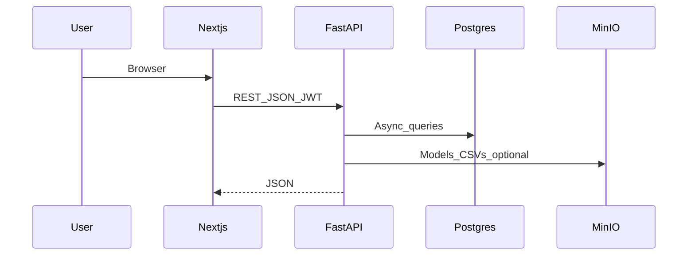

# Architecture reference (ProphitBet)

Companion to root [`AGENTS.md`](../AGENTS.md). Deeper data-flow diagrams for agents and maintainers.

## SaaS data pipeline

## Request path (user-facing)

## Desktop vs SaaS ML boundary

- **Single implementation** of statistics, features, and sklearn pipelines: [`src/`](../src/).
- **SaaS** loads the same code by setting `PYTHONPATH` / `ML_CORE_PATH` so `import src.*` resolves inside containers.
- **Thin layers** in `prophitbet-saas/backend/app/services/` adapt DataFrames, S3 bytes, and Celery jobs — they should not reimplement feature logic.

## Failure modes to remember

- **Sync** can be slow (many leagues) and may skip leagues with CSV/schema issues; check Celery logs.
- **FootyStats** HTML differs between desktop Selenium and SaaS httpx parsers; change both if the site structure shifts.
- **Predictions** need house models + non-empty upcoming fixtures + synced datasets per league.
